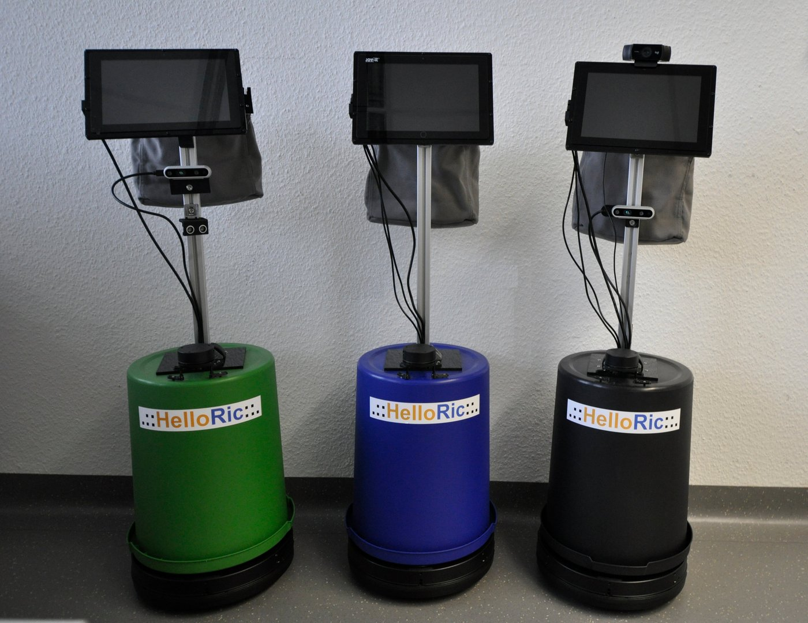

# HelloRIC - Documentation

HelloRic is a robotic student project hosted by the [University of Bremen](https://www.uni-bremen.de/) in collaboration with the [DFKI Robotics Innovation Center](https://robotik.dfki-bremen.de/de/startseite) in Bremen.
The goal of the project is to create a robotic tour guid for the [DFKI Robotics Innovation Center](https://robotik.dfki-bremen.de/de/startseite) which can show guests around.

## Teaching Goals
In the Project we aim to teach students about several aspects of robotics and AI including:

- Human Robot Interaction
- Robot perception
- Navigation and Obstacle Avoidance
- Large Language Models
- Mechanics
- Electrical engineering
- UX Design
- Project Management
- Agile Software Development
- DevOps
- and many more

Furthermore the students will learn how to use

- ROS2
- Docker
- Gazebo
- git (GitLab)
- Visual Studio Code
- and many more

HelloRic accepts students from 

- [Digital Media](https://www.uni-bremen.de/studium/orientieren-bewerben/studienangebot/dbs/study/1) (Bachelor and Master)
- [Computer Science](https://www.uni-bremen.de/studium/orientieren-bewerben/studienangebot/dbs/study/25) (Bachelor and Master)
- [Systems Engineering](https://www.uni-bremen.de/studium/orientieren-bewerben/studienangebot/dbs/study/41?cHash=1a958e37171965afa46e44b91aa3f5d0) (Bachelor and Master)

## Scientific Goals
The continuous development of the HelloRic System will enable Students and Researchers to conduct studies in the field of Human Robot Interaction. Additionally we aim to contribute to the field of robotics by providing an open source fully functional low cost robotic system to the scientific community.

